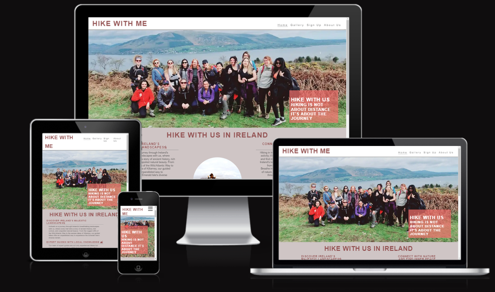

### HIKE WITH ME 
***
(By Preeti Singh)
## Welcome to Hike with Me! 

# Table Of Contents

- [Hike With Us](#milestone-1-project--hike-with-us)

- [Introduction](#introduction)

- [Features](#features)
    - [Navigation Bar](#Navigation)
    - [The landing page image](#thelandingpageimage)
    - [What We Offer](#What-we-offer)
    - [Trail Information](#Trail-Information)
    - [The Footer](#The-Footer)
    - [Gallery](#gallery)
    - [The Sign Up Page](#The-Sign-Up-Page)

- [Testing](#testing)
    - [Validation](#Validation)
    - [Responsiveness](#Responsiveness)
  
- [Unfixed Bugs](#Unfixed-Bugs)
  
- [Deployment](#Deployment)

- [Credits](#Credits)
   - [Content](#Content)
   - [Media](#Media)
 
- [Acknowledgements](#Acknowledgements)

## Introduction

This page is dedicated to community of hiking enthusiasts from all across Ireland. Our mission is to bring together people who share a passion for hiking, whether you're an experienced trekker or just starting out. Join us to explore Ireland's stunning trails, discover new places, and make lasting friendships.

## Features 
- __Navigation Bar__

  - Featured on all four pages, the full responsive navigation bar includes links to the  Home page, Gallery,Sign Up  and About US page and is identical in each page to allow for easy navigation.
  - This section will allow the user to easily navigate from page to page across all devices without having to revert back to the previous page via the ‘back’ button. 

- __The landing page image__

    - The landing includes a photograph with text overlay to allow the user to see exactly which location this site would be applicable to. 
    - This section introduces the user to HIKE WITH ME with an eye catching animation to grab their attention

- __What We Offer__

   We aim to:
   - Encourage the exploration of the beautiful Irish outdoors.
   - Promote physical and mental well-being through hiking.
   - Provide a supportive and fun environment for all outdoor enthusiasts.

- __Trail Information__

  - This section will allow the user to learn about some of our favourite hiking trails. 
  - These are top-rated hiking trails recommended by our community members.

- __The Footer__ 

  - The footer section includes links to the relevant social media sites for HIKE WITH ME. The links will open to a new tab to allow easy navigation for the user. 
  - The footer is valuable to the user as it encourages them to keep connected via social media.

- __Gallery__

  - The gallery will provide the user with supporting images to see what the meet ups look like. 
  - This section is valuable to the user as they will be able to easily identify the types of events the organisation puts together. 

- __The Sign Up Page__

  - This page will allow the user to get signed up to Love Running to start their hikingjourney with the community. The user will be able specify if they would like to take part in road, trail or both types of running. The user will be asked to submit their full name and email address. 

- __Wireframe__

Wireframe - Homepage Desktop & Mobile
  

 

Wireframe - Gallery page Desktop
  

 

Wireframe - Gallery page Mobile
  

    

Wireframe - SignUp page Desktop
  

 

Wireframe - SignUp page Mobile
  

              

## Testing 

- __Validation__

  * [HTML Validator](https://validator.w3.org/) was run at several points during the project and small syntax errors identified were fixed. At the final stage no errors or warnings were found
  * [CSS Validator](https://validator.w3.org/) was run several times during the project and picked up small syntax errors which were corrected. At the time of submission the css code successfully passed the validator with no errors.

- __Responsiveness__

   The website was tested on Chrome, Mozilla, Edge and Safari browsers with no problems found.

   The website was tested on numerous sized screens including Iphones 12 and 13,Samsung flip 5 , 15" laptop, 24" screen and Ipad and was found to respond as expected to all sizes.
Chrome development tools was used throughout the design process to check responsiveness and breakpoints. Adjustments were made accordingly.

- __Lighthouse Testing__

    Lighthouse testing was performed by Google's open source tool, 
    [Google Chrome DevTools](https://developers.google.com/web/tools/lighthouse). 

   - index.html 

    

   - gallery.html

   

   - signup.html

   

### Unfixed Bugs

Need to update

### Deployment

The site was deployed to GitHub pages. The steps taken to deploy are as follows:
1. Log in to [Github](https://github.com/)
2. Navigate to [preeticancode/HIKE-WITH-ME](https://github.com/preeticancode/HIKE-WITH.gitME) in  
   the list of repositories
3. In the GitHub repository, navigate to the [Settings] tab
4. In Settings scroll down to [GitHub pages] which opens in a new page.
5. From the source section drop-down menu, select the Master Branch
6. Once the master branch has been selected, the page is automatically refreshed and a display indicates the successful deployment and the link to the address.

The link to the live website is here:
https://preeticancode.github.io/HIKE-WITH-ME/

## Credits 

### Content 

- The text for the Home page was taken google article.
- Code structure taken from Love Running.
- The icons in the footer were taken from [Font Awesome](https://fontawesome.com/)

### Media

- The photos used on the home and sign up page are from our group hiking trip and some are mine.
- The some images used for the gallery page were taken from this other open source site.

## Acknowledgements

I would like to take the opportunity to thank:
- My mentor David Bowers for his feedback, advice, guidance and support.
- My husband Rajesh for his support, advice, help with testing, and for giving me some kids free 
  time to work on my project.
- To the lovely people on the Code Institute Slack for providing peer code reviews.
- My friends and community memebers who are part of HIKE WITH ME.

  

[def]: /workspace/my-kitchen/documents/responsive.png
[def2]: #features