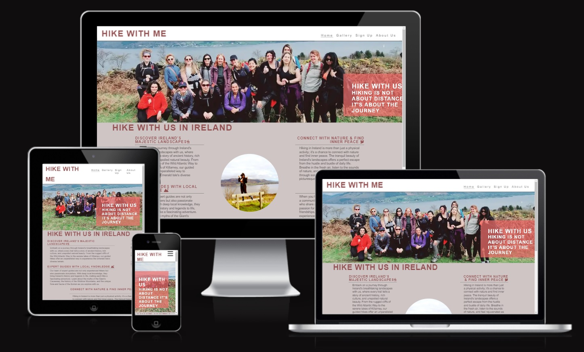
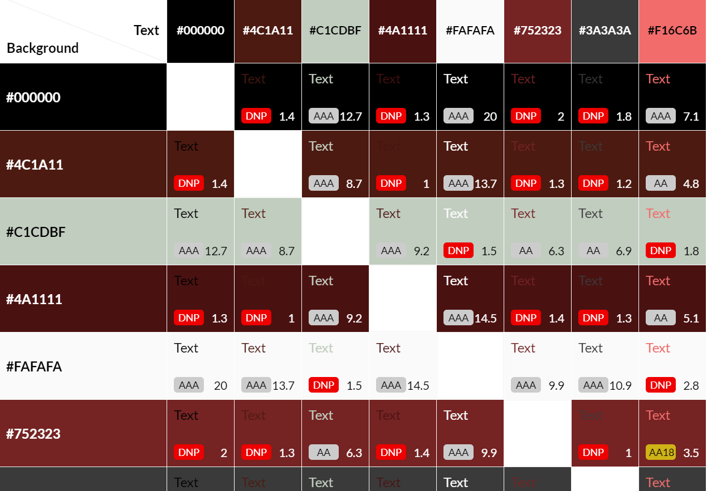
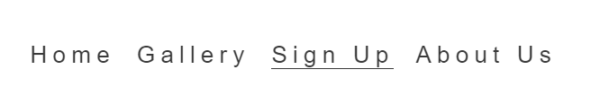
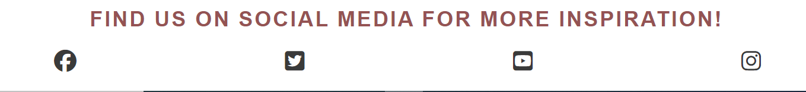
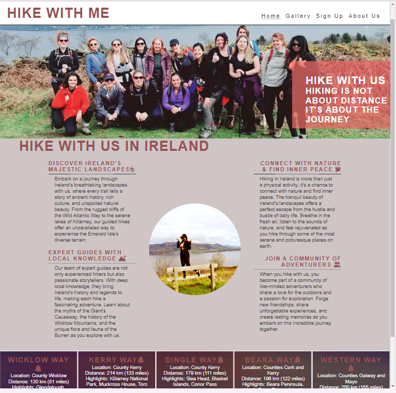
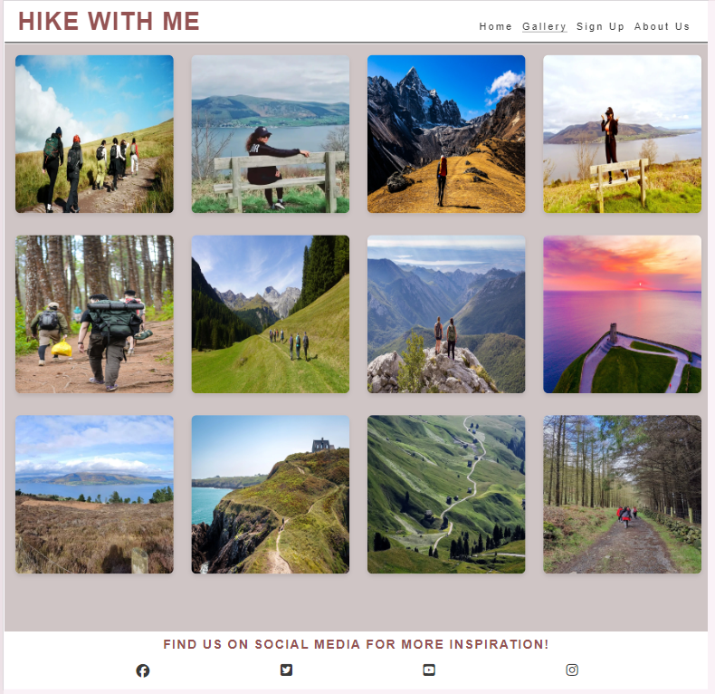
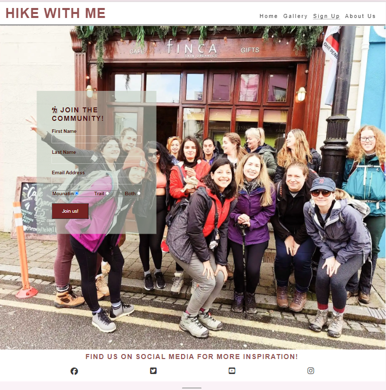
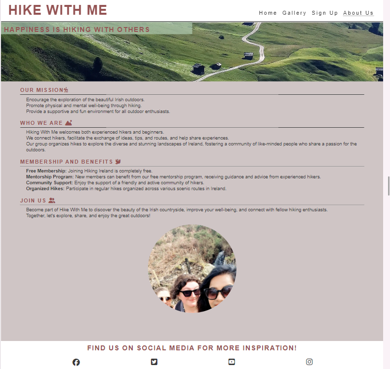
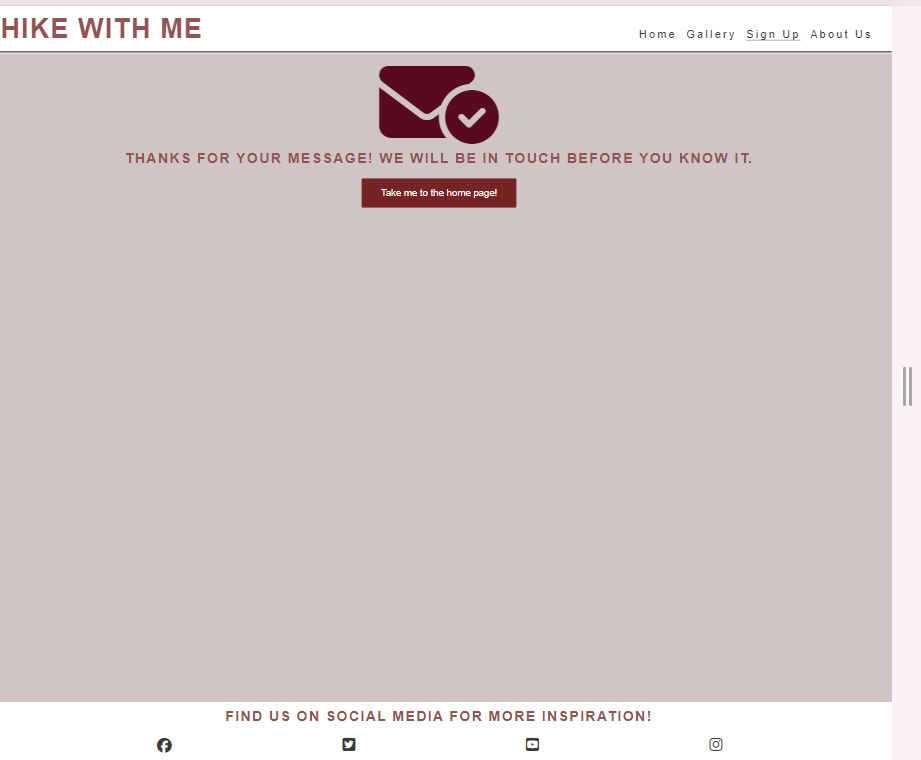

## Welcome to Hike with Me! 

## **Site Overview**
This page is dedicated to community of hiking enthusiasts from all across Ireland. Our mission is to bring together people who share a passion for hiking, whether you're an experienced trekker or just starting out. Join us to explore Ireland's stunning trails, discover new places, and make lasting friendships.

***
***(By Preeti Singh)***

## [Link to Live Website](https://preeticancode.github.io/hike-with-me/)

## Table of contents:
1. [**Site Overview**](#site-overview)
2. [**Planning stage**](#planning-stage)
    * [***Target Audiences***](#target-audiences)
    * [***User Stories***](#user-stories)
    * [***Site Aims***](#site-aims)
    * [***Wireframes***](#wireframes)
    * [***Color Scheme***](#color-scheme)
3. [**Current Features Common to all pages**](#current-features-common-to-all-pages)
    * [***Header Element:***](#header-element)
        * [*Title*](#title)
        * [*Navigation Bar*](#navigation-bar)
    * [**Footer**](#footer)
    * [**Typography**](#typography)
4. [**Individual Page Content features**](#individual-page-content-features)
    * [**Home Page Content**](#about-page-content)
    * [**Gallery Page Content**](#teachings-page-content)
    * [**Sign Up Page Content**](#community-page-content)
    * [**About Us Page Content**](#contact-page-content)
    * [**Sign Up Feedback Page Content**](#form-feedback-page-content)
5. [**Future-Enhancements**](#future-enhancements)
6. [**Testing Phase**](#testing-phase)
7. [**Deployment**](#deployment)
8. [**Credits**](#credits)
    * [**Frameworks, Libraries & Programs Used**](#Frameworks-Libraries-&-Programs Used)
    * [**Content**](#general-reference)
    * [**Media**](#content)
    * [**Honorable mentions**](#media)

## **Planning stage**
### **Target Audiences:**
1. *Outdoor Enthusiasts*: People who love nature and outdoor activities.
2. *Fitness Enthusiasts*: Individuals looking for physical exercise through hiking.
3. *Adventure Seekers*: Those who enjoy exploring new trails and challenging terrains.
4. *Families*: Parents and children looking for family-friendly hiking activities.
5. *Environmentalists*: People interested in conservation and appreciating natural beauty.
6. *Social Seekers*: Individuals looking to make friends and connect with like-minded people.
7. *Beginners*: New hikers seeking guidance, tips, and beginner-friendly trails.
8. *Experienced Hikers*: Seasoned hikers looking for advanced trails and sharing their experiences.

### **User Stories:**
* User who are Nature Enthusiast / Hiker.
* Discover new hiking trails, connect with other hikers, share each-other experiences, and access hiking resources.
* User can enhance my hiking adventures, gain valuable insights, and contribute to the hiking community.

### **Site Aims:**
1. *Foster Community Engagement*: Create a vibrant and interactive platform where hikers of all levels can connect, share experiences, and support each other.

2. *Provide Comprehensive Trail Information*: Offer detailed and up-to-date information on hiking trails, including maps, difficulty ratings, directions, and user reviews, to help members plan their hikes effectively.

3. *Promote Safety and Preparedness*: Educate members on hiking safety, emergency procedures, and best practices to ensure safe and enjoyable hiking experiences.

4. *Encourage Outdoor Activity*: Inspire people to explore the outdoors and lead a healthy lifestyle by participating in hikes and outdoor events.

5. *Support Skill Development*: Provide resources, guides, and tips to help hikers improve their skills and knowledge, catering to beginners and experienced hikers alike.

6. *Facilitate Event Organization*: Streamline the process of organizing and participating in group hikes and community events through an easy-to-use event calendar and RSVP system.

7. *Enhance Environmental Awareness*: Promote responsible hiking practices and environmental stewardship, encouraging members to respect and preserve natural habitats.

8. *Enable Photo and Experience Sharing*: Allow members to upload and share photos, videos, and stories from their hikes, fostering a sense of community and shared adventure.

9. *Offer Personalized Experiences*: Allow members to create profiles, track their hiking progress, and receive personalized recommendations based on their preferences and activity.

10. *Provide Support and Feedback Channels*: Ensure members can easily contact community organizers for support, ask questions, and provide feedback to continuously improve the website and community experience.

### **Wireframes:**
To organize my thoughts and prevent scope creep, I created wireframes for this project. Below are links to each of the mobile and desktop versions of the four intended pages. 

* Mobile Wireframes:
    * [Homepage (About)](docs/wireframes/index-mobile.png)
    * [Gallery page](docs/wireframes/gallery-mobile.png)
    * [Sign Up page](docs/wireframes/signup-mobile.png)
    * [About Us page](docs/wireframes/aboutus-mobile.png)

* Desktop wireframes:
    * [Homepage (About)](docs/wireframes/index-desktop.png)
    * [Gallery page](docs/wireframes/gallery-desktop.png)
    * [Sign Up page](docs/wireframes/signup-desktop.png)
    * [About Us page](docs/wireframes/aboutus-desktop.png)
  There was some deviation from the original wireframes to improve the User Experience (UX).

### **Color Scheme:**
When deciding the color scheme, I wanted to go with something that gave an elegant appearance. For this reason, I selected a range of blue and gold's and used the following color grid created on [https://contrast-grid.eightshapes.com/](https://contrast-grid.eightshapes.com/?version=1.1.0&background-colors=&foreground-colors=%230000001A%0D%0A%234c1a11%0D%0A%23C1CDBF%0D%0A%234a1111%0D%0A%23fafafa%0D%0A%23752323%0D%0A%233a3a3a%0D%0A%23f16c6b%0D%0A%0D%0A%0D%0A&es-color-form__tile-size=compact&es-color-form__show-contrast=aaa&es-color-form__show-contrast=aa&es-color-form__show-contrast=aa18&es-color-form__show-contrast=dnp) to check the contrast scores. Using this grid allowed me to ensure all text remained visible and the site was accessible to all.

## **Current Features Common to all pages**
###  **Header Element**
The header element sticks to the top of the page as the user scrolls up and down. Originally I had designed the page with a "return to top" link at the bottom of the page. However, a Code Institute graduate pointed out that the sticky header would provide a more pleasant UX and adhere to popular conventions better. The header itself contains the following features: 

#### *Title:*

* The title serves to state the name of the community.
* It also serves as a navigation link to the home page as per the well-established convention expected by the user.

#### *Navigation Bar:*
* The navigation bar appears on all four pages (including the form feedback page). 
* It contains links to the home, gallery,sign up, and about us page to allow easy navigation around the website. 
* The below image shows the user's current page highlighted in blue with a white border. 

***

## **Footer**
* The footer includes direct links to all  social media accounts.

* These icons were imported from font awesome at the bottom of the page. 

## **Typography**
* Throughout the page, there are three fonts used:
  * Lato sans-serif - For the title to give it a strong presence.
  * Lato sans-serif - For all other headings including the navbar. 
  * Oswald sans-serif - for all content text.

* All fonts were sourced from Google fonts, as stated in the credits.

## **Individual Page Content features**
### **Home Page Content:**
This page gives encorages guided hikes across Ireland's scenic routes such as the Wicklow Way, Kerry Way, and Dingle Way. It emphasizes the expertise of local guides, the cultural and historical significance of the trails, and the camaraderie among hikers. The site encourages a deep connection with nature through Ireland's tranquil landscapes.

### **Gallery Page Content:**
The "Gallery" page on the "Hike with Me" website by Preetica showcases a collection of photos from various hiking adventures. The page is designed to visually engage visitors by displaying beautiful and scenic images of nature, trails, mountains, and other outdoor experiences. Each photo captures unique moments and landscapes from different hikes, reflecting the beauty and diversity of the natural world.

Key features of the page include:

Photo Grid Layout: The images are arranged in a grid format, allowing visitors to view multiple photos at once. This layout is visually appealing and makes it easy to browse through the collection.

High-Quality Images: The photos are high-resolution, ensuring that details are clear and the beauty of the landscapes is fully appreciated.

Captions and Descriptions: Each photo may include captions or brief descriptions, providing context such as the location of the hike or the significance of the moment captured.

User Experience: The gallery is designed to be user-friendly, with intuitive navigation and a clean, minimalist aesthetic that keeps the focus on the images.

Overall, the "Gallery" page serves as an inspiring visual showcase of hiking adventures, encouraging visitors to explore and appreciate the great outdoors.

### **Sign Up Page Content:**
The "Sign Up" page on the "Hike with Me" website by Preetica is designed to allow visitors to register for the website or specific hiking events and activities. Here's a brief overview of its features:

Registration Form: The page includes a registration form where users can enter their personal information. Typical fields might include:

Name
Email Address
Password
Confirm Password
Additional fields like phone number, preferred hiking difficulty level, or interests might also be present.
User-Friendly Design: The form is designed to be straightforward and easy to fill out, ensuring a smooth user experience. Labels and placeholders guide the user on what information is required.

Security Features: The page likely includes security features such as password strength indicators and validation checks to ensure that users provide valid and secure information.

Call to Action: Prominent "Sign Up" or "Register" buttons encourage users to complete the registration process.

Navigation Links: Links to other parts of the website, such as the login page for existing users, the home page, or the privacy policy, are typically included.

Visual Elements: The page maintains a consistent visual theme with the rest of the website, possibly incorporating images or graphics related to hiking to keep the aesthetic appealing and relevant.

Overall, the "Sign Up" page is a crucial part of the "Hike with Me" website, providing a gateway for new users to join the community and participate in hiking activities.

### **About Us Page Content**
The "About" page on the "Hike with Me" website by Preetica provides visitors with information about the website's purpose, mission, and the people behind it. Here's a brief overview of its content and features:

Introduction: The page typically begins with an introduction that explains the main purpose of the website. This might include an overview of what "Hike with Me" is about, such as promoting hiking as a recreational activity, encouraging outdoor exploration, and building a community of hiking enthusiasts.

Mission Statement: A clear and concise mission statement outlines the goals and values of "Hike with Me." This might focus on themes like fostering a love for nature, promoting physical fitness, and encouraging sustainable hiking practices.

Founder's Story: Information about Preetica, the founder of the website, is provided. This section might include a personal story about how Preetica developed a passion for hiking, the inspiration behind creating the website, and any relevant background information.

Team Members: If applicable, the page might introduce other key team members or contributors who help run the website or organize hiking events.

Values and Philosophy: This section elaborates on the core values and philosophy guiding "Hike with Me," such as environmental conservation, community building, inclusivity, and adventure.

Activities and Services: An overview of the activities and services offered by the website, such as guided hikes, hiking tips, trail recommendations, and community events.

Visual Elements: The page is likely enhanced with relevant images, such as photos of hiking trips, scenic landscapes, and candid shots of the founder or team members enjoying outdoor activities. These visuals help create a personal connection with the audience.

Contact Information: Contact details or a link to a contact page might be provided, encouraging visitors to reach out with questions, feedback, or to get involved.

Overall, the "About" page serves to build trust and rapport with visitors by sharing the story, mission, and values behind "Hike with Me," while also providing a glimpse into the community and activities associated with the website.

### **Sign Up Feedback Page Content**
The "Sign Up Feedback" page on the "Hike with Me" website provides a confirmation and summary of the information submitted during the sign-up process. Based on the URL provided, it appears that this page is dynamically generated to display personalized feedback to the user. Here’s a brief overview of its features and content:

Personalized Confirmation Message: The page likely starts with a greeting that includes the user's first name, confirming that their sign-up was successful. For example, "Thank you for signing up, Grg!"

Summary of Submitted Information: The page displays a summary of the information the user entered during the sign-up process. This includes:

First Name: 
Last Name: 
Email Address: 
Running Preference: 
Next Steps: Instructions or suggestions on what the user can do next. This might include links to:

Explore upcoming hiking events or trails.
Join the community forum or social media groups.
Check their email for a confirmation message or further details.
Call to Action: A button or link encouraging the user to proceed to other parts of the website, such as browsing the gallery, reading the blog, or updating their profile.

Visual and Design Elements: Consistent with the website’s overall aesthetic, the page is likely designed with a clean and user-friendly interface, possibly featuring nature-themed visuals or graphics.

Contact Information: In case of any issues or questions, the page might include contact details or a link to the support page.

Overall, the "Sign Up Feedback" page is designed to confirm the successful registration of a new user, provide a summary of their submitted information, and guide them towards further engagement with the "Hike with Me" community and resources.

## **Future-Enhancements**
Enhancing the "Hike with Me" website's in future can improve user engagement, provide better information, and create a more interactive experience. Here are some features I think can be good  for future enhancements:
1. Interactive Map
Feature: Interactive map that highlights popular hiking trails.
Benefit: Users can visualize and explore different hiking locations.
2. User Testimonials
Feature: Section for user testimonials.
Benefit: Builds trust and encourages new users to join by showcasing positive experiences.
3. Event Calendar
Feature: Integrating a calendar displaying upcoming hiking events and activities.
Benefit: Keeps users informed and helps them plan their participation.
4. Search Functionality
Feature: Implementing a search bar to help users quickly find information on trails, tips, or blog posts.
Benefit: Enhances user experience by making navigation easier.
5. Featured Hikes Section
Feature: Highlighting featured hikes of the month with detailed descriptions and images.
Benefit: Promotes specific trails and keeps content fresh and engaging.
6. Newsletter Signup
Feature: Adding a newsletter signup form.
Benefit: Allows users to stay updated with the latest news, tips, and events directly in their inbox.
7. Community Forum
Feature: Creating a community forum where users can share experiences, tips, and ask questions.
Benefit: Fosters a sense of community and encourages user interaction.
8. Enhanced Visuals and Videos
Feature: Incorporating high-quality visuals and video content, such as drone footage of hikes.
Benefit: Creates a more immersive experience and showcases the beauty of hiking locations.
9. Mobile Optimization
Feature: Ensuring the website is fully optimized for mobile devices.
Benefit: Improves accessibility and user experience on smartphones and tablets.
10. Blog Section
Feature: Adding a blog section with posts on hiking tips, gear reviews, and personal stories.
Benefit: Provides valuable content that can attract and retain users.
11. User Profiles and Badges
Feature: Allowing users to create profiles and earn badges for completing hikes or participating in events.
Benefit: Adds a gamification element, encouraging user engagement and activity.
12. Live Chat Support
Feature: Implementing a live chat support feature for immediate assistance.
Benefit: Enhances user support and improves overall user satisfaction.
13. Accessibility Features
Feature: Ensureing the site includes accessibility features like screen reader compatibility and adjustable text sizes.
Benefit: Makes the website usable for a broader audience, including those with disabilities.
14. Sustainability Tips
Feature: Including a section dedicated to sustainable hiking practices.
Benefit: Educates users on how to minimize their environmental impact while enjoying nature.
15. Social Media Integration
Feature: Integrating social media feeds and sharing buttons.
Benefit: Encourages social sharing and increases the website’s reach.
By implementing these enhancements, the "Hike with Me" homepage can become a more engaging, informative, and user-friendly platform for hiking enthusiasts.
***

## **Testing Phase**
I have included details of testing both during development and post development in a separate document called [TESTING.md](TESTING.md).
***

## **Deployment**
The site was deployed to GitHub pages. The steps taken to deploy are as follows:
1. Log in to [Github](https://github.com/)
2. Navigate to [preeticancode/hike-with-me](https://github.com/preeticancode/HIKE-WITH.gitME) in  
   the list of repositories
3. In the GitHub repository, navigate to the [Settings] tab
4. In Settings scroll down to [GitHub pages] which opens in a new page.
5. From the source section drop-down menu, select the Master Branch
6. Once the master branch has been selected, the page is automatically refreshed and a display indicates the successful deployment and the link to the address.

The link to the live website is here:
https://preeticancode.github.io/hike-with-me/
***

## **Credits**
### **Frameworks, Libraries & Programs Used**
Balsamiq - Used to create wireframes.

Git - For version control.

Github - To save and store the files for the website.

Google Fonts - To import the fonts used on the website.

Font Awesome - For the iconography on the website.

Google Dev Tools - To troubleshoot and test features, solve issues with responsiveness and 
    styling.

Tiny PNG To compress images.

Convertio To convert images to webp format.

Redketchup to resize image.

Favicon.io To create favicon.

Am I Responsive? To show the website image on a range of devices.

### **Content**
All content was written by myself and fewtext for the Home page was taken google article.

Form contents and footer code used on main page taken from Love Running Project.

The icons in the footer were taken from [Font Awesome](https://fontawesome.com/)

Accessibility checker - [WAVE - Web accessibility evaluation tool](https://wave.webaim.org/)

The golden gradient colour scheme - [brandgradients.com](http://www.brandgradients.com/gold-gradient).
  

### **Media**
The photos used on the home and sign up page are from our group hiking trip and some are mine.

The some images used for the gallery page were taken from this other open source site.

Screenshot under README.md section titled "site overview" was created view [Am I responsive](http://ami.responsivedesign.is)

Color grid contract tool - [Eightshapes](https://contrast-grid.eightshapes.com/) 

### **Honorable mentions**
I would like to take the opportunity to thank:
- My mentor David Bowers for his feedback, advice, guidance and support.
- My husband Rajesh for his support, advice, help with testing, and for giving me some kids free 
  time to work on my project.
- To the lovely people on the Code Institute Slack for providing peer code reviews.
- My friends and community memebers who are part of HIKE WITH ME.
***