# Testing Page Table of Contents
* [**During Development Testing**](#during-development-testing)
    * [*Manual Testing*](#manual-testing)
    * [*Bugs and Fixes*](#bugs-and-fixes)
* [**Post Development Testing**](#post-development-testing)
  * [**Validators**](#validators)
      * [*HTML*](#html---httpsvalidatorw3orgnu)
      * [*CSS*](#css---httpsjigsaww3orgcss-validator)
  * [**Lighthouse Scores**](#lighthouse-scores)
      * [*Mobile Version*](#mobile-version)
      * [*Desktop Version:*](#desktop-version)
  * [**Accessability**](#accessability)
  * [**Unfixed Bug**](#unfixed-bug)

## **During Development Testing**
During the development process, I was manually testing in the following ways:-

1. Manually testing each element for appearance and responsiveness,I used Chrome developer tools extensively during development to troubleshoot issues.
    
2. Published the page via GitHub pages and shared with fellow students to test and received feedback.

### ***Manual Testing:***
* During testing, I used four different browsers to ensure cross-compatibility. The desktop browsers used by myself were:

  1. Chrome
  2. Firefox  
  3. Opera
  4. Edge

* I then used the devtools to simulate different screen sizes/devices from 320 px up to 4000px in width. 
* In addition to this, I also asked several people to test using iPhones and Apple Mac laptops/desktops using safari. These users reported no issues or bugs only style suggestions.

### ***Bugs and Fixes:***

Below is a list of bugs I found during the development process by testing myself via the live server extension on VSCode. I tried each element for how the browser would display the page to potential users on a range of different screen widths from 320px to 4000px:-

1. **Intended Outcome** - Header section in hero item should be properly aligned.
    * ***Issue Found:*** 
        * Hero section header was not properly aligned.
    * ***Solution Used:*** 
        * Used CSS flex display.
2. **Intended Outcome** - Sign up feedback page main section should be propely aligned.
    * ***Issue Found:*** 
        * Initially sign up feedback page main section should wan not propely aligned contained in the main section. 
    * ***Solution Used:***    
        * I resolved this by using padding on the join button whilst keeping the elements centred using flex. Also, some css style was overlapping.

        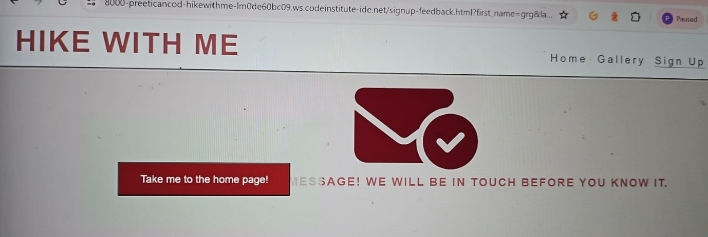
3. **Intended Outcome** - Sign up form suited to all screen sizes.
    * ***Issue Found:*** 
        On smaller screen sizes, form was moving upward in the browsers dev tools.
    * ***Solution Used***:
        Resolved by adding margin and center in CSS.

        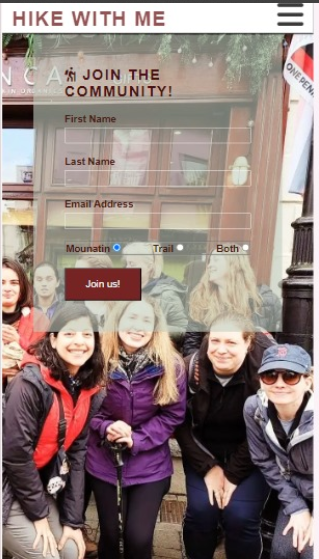
4. **Intended Outcome** -Sign up feedback page, return to home page button should work properly.
    * ***Issue Found:*** 
        Return to home page button waas not working.
    * ***Solution Used:*** 
        Lined home(index page) button in HTML.
    
5. **Intended Outcome** - Aligned gallery images looking uniform and neat.
    * ***Issue Found:*** 
        All images were huge in size and it was impacting performace.
    * ***Solution Used:***
        * I used RedKetchup image resizer to resize images and TinyPNG to convery to WEBP and compress.
6. **Intended Outcome** - When screen sizes exceed 768px in width, the two articles on the community page display side-by-side.
    * ***Issue Found:***
        * When getting to around 2600px, the heading would move to the side of the articles.
    * ***Solution Used:***
        * I split the page's content into separate sections, so the two articles were separate from the introduction paragraph with the heading "ways to connect in person". The way I divided the content later caused an issue on post-development testing that I will discuss later in this document.
    
## **Post Development Testing**
### **Validators**

#### ***HTML*** - https://validator.w3.org/nu/

* ***Issue Found:***
   I had missed some closing tags.
* ***Solution Used:***
    It helped in checking my HTML .

#### ***CSS*** - https://jigsaw.w3.org/css-validator/

* All pages tested, no issues found via URL or file upload.\

### **Lighthouse Scores**
### **Test conditions**
* I did all lighthouse tests in incognito mode to avoid interference from browser extensions. 
* I ran the tests for both mobile and desktop. 
* I asked people to run lighthouse tests from their own devices. 
#### ***Mobile Version:***
1. ***index.html:***
    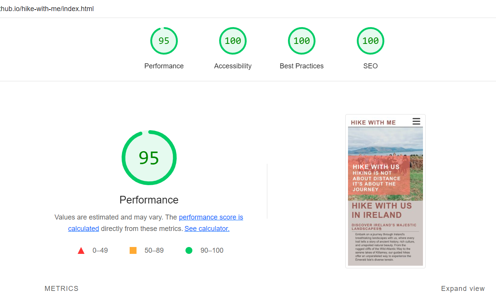 

2. ***gallery.html:***

    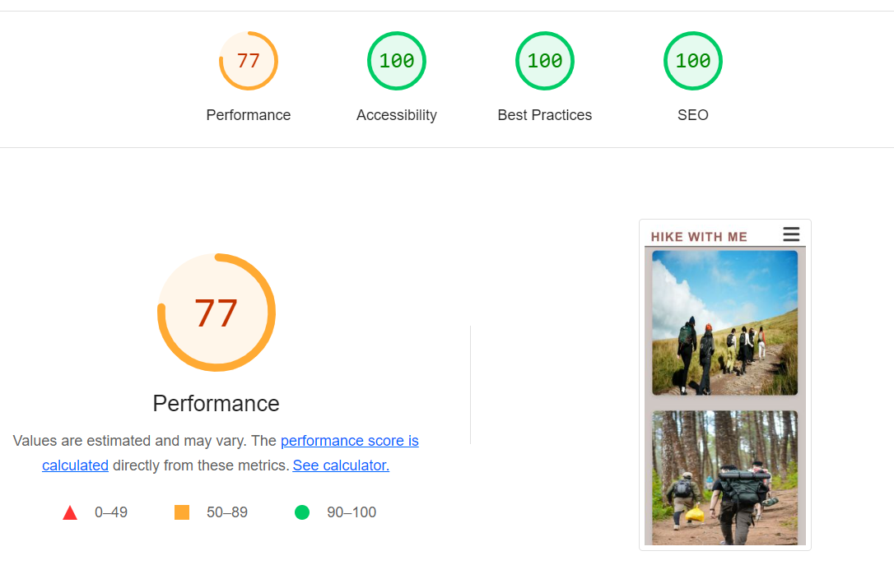
    I found the performance score on this page lower due to the multiple pictures.  I used https://tinypng.com/ to compress the images on this page

3. ***signup.html:***

    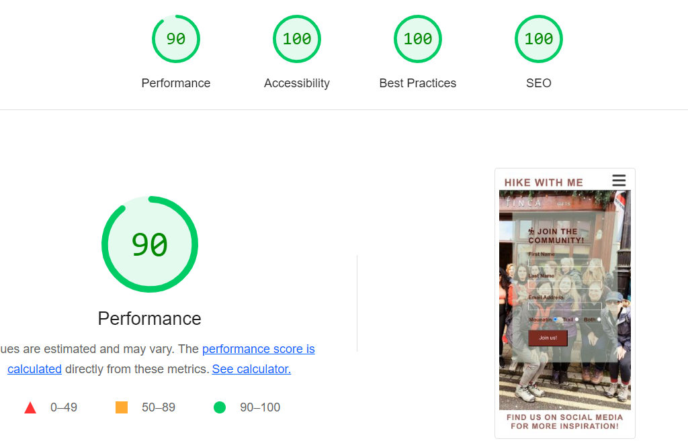 

4. ***aboutus.html:***

    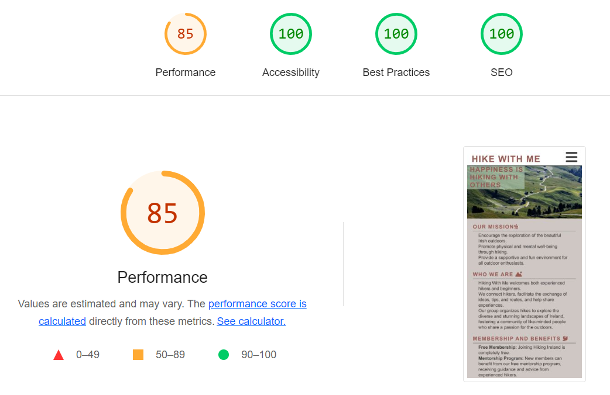

5. ***signup-feedback.html:***

    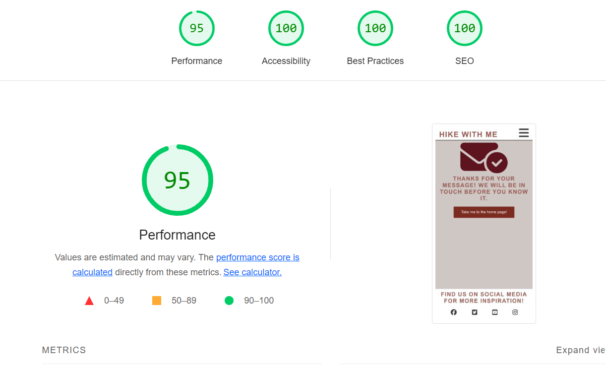

#### ***Desktop Version:***
1. ***index.html:***
    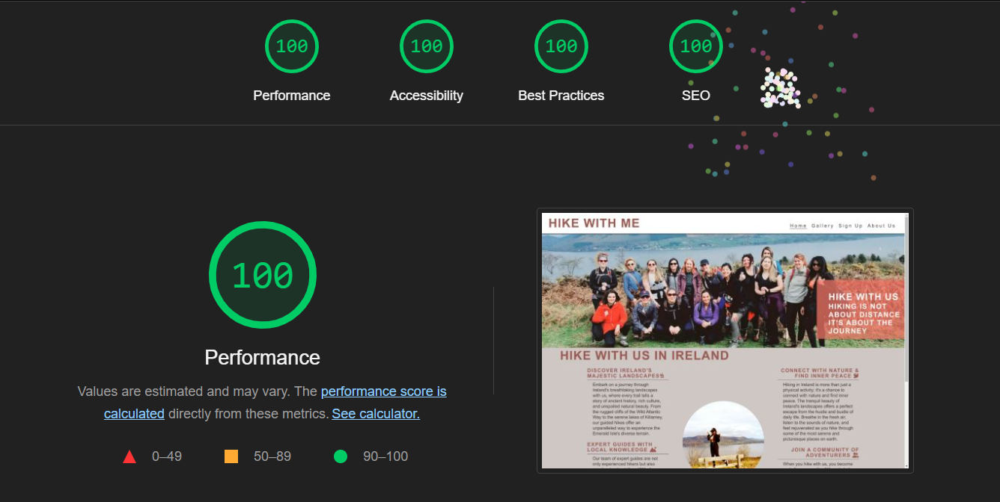 

2. ***gallery.html:***

    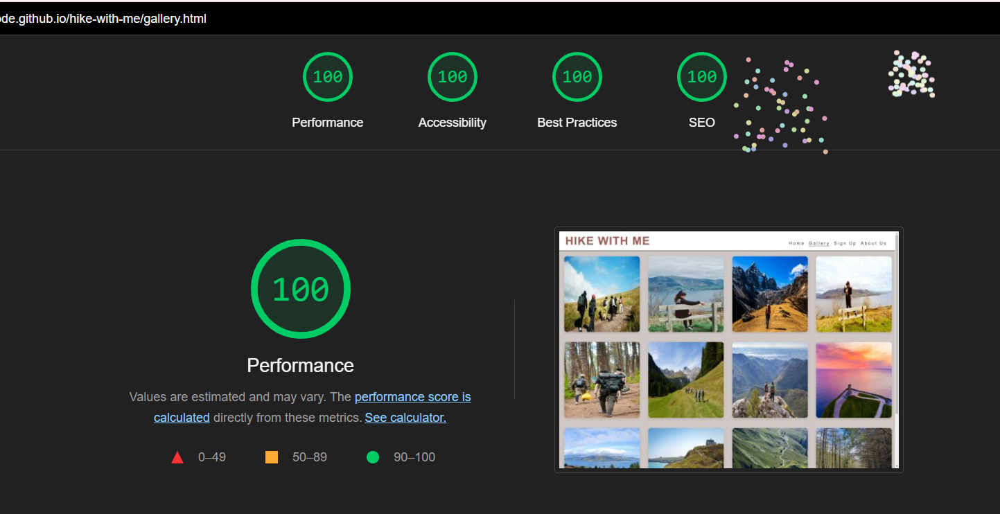
    I found the performance score on this page lower due to the multiple pictures.  I used https://tinypng.com/ to compress the images on this page

3. ***signup.html:***

    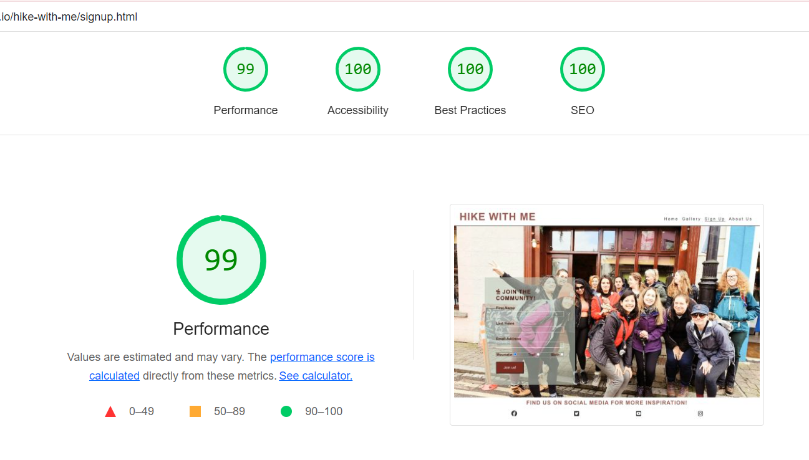 

4. ***aboutus.html:***

    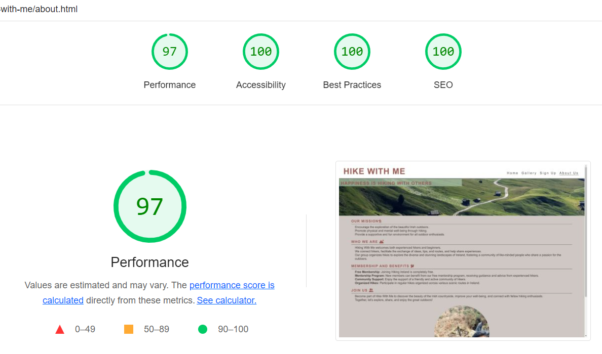

5. ***signup-feedback.html:***

    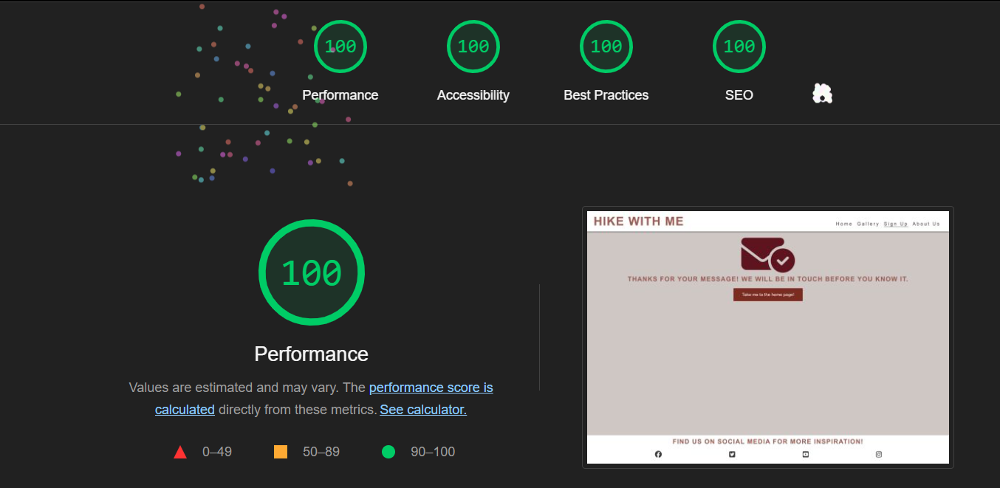

  
### **Accessability**
In addition to the accessability score on light house I also used [WAVE - Web accessability evaluation tool](https://wave.webaim.org/) to check my pages for accessability and no errors were returned.
***   

### **Unfixed bugs**
Migration from a personal email address to a student Google Workspace email address for your GitHub and Gitpod accounts caused some confusion, especially regarding your GitHub contributions.
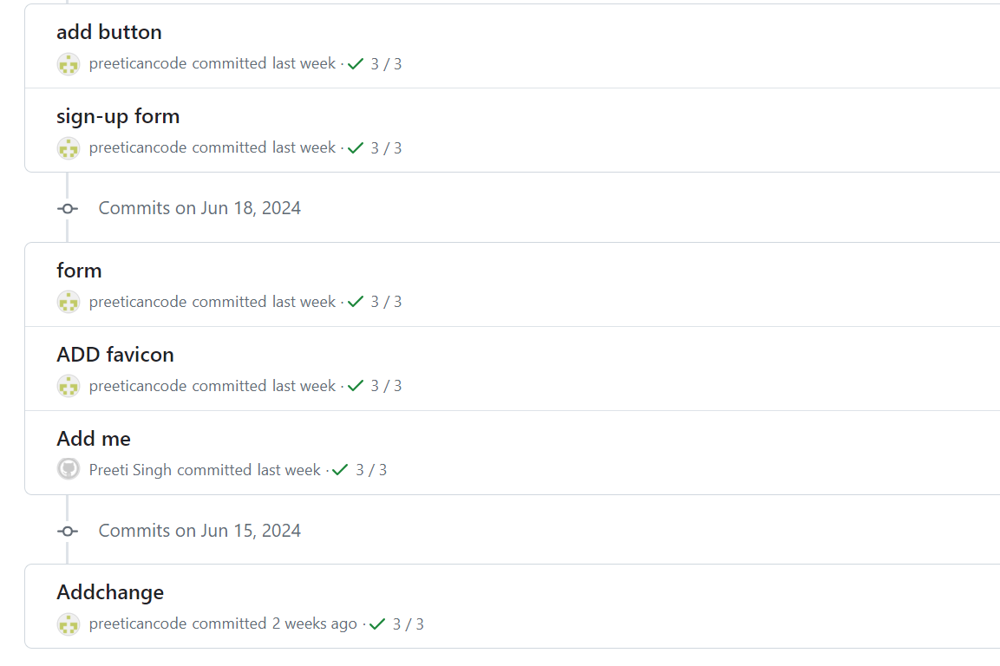
***

[return to README.md](README.md)